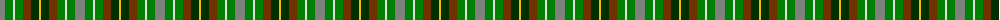
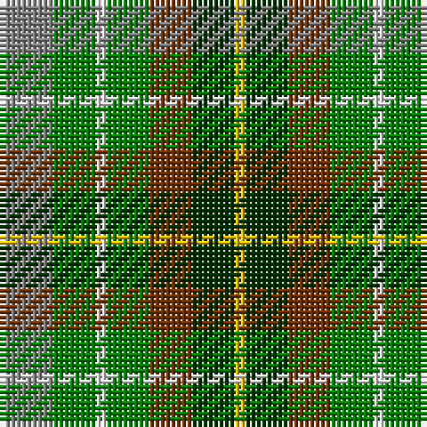

The parent of this is [Devon, Original](/tartans/n/10/g8/ln2/g8/t8/dg8/y/2/)

This was sourced from weddslist.  It is a [7 stripes tartan](/stripes/stripes7/).

Original link http://www.weddslist.com/cgi-bin/tartans/pg.pl?source=sts

## Thread count
N/10 G8 LN2 G8 T8 DG8 Y/2

## Palette
Each colour and its ΔE from the base-6 reference it is a variant of.

| Colour | Shade | Base | ΔE (OKLab) |
|---|---|---|---|
| DG |  `#003000` | G  | 0.18 |
| G |  `#008000` | G  | 0.09 |
| LN |  `#E0E0E0` | W  | 0.06 |
| N |  `#808080` | G  | 0.22 |
| T |  `#703000` | R  | 0.18 |
| Y |  `#F0C000` | Y  | 0.01 |

# Sample pattern

ID: /variants/n/10/g8/ln2/g8/t8/dg8/y/2-dg003000-g008000-lne0e0e0-n808080-t703000-yf0c000/
