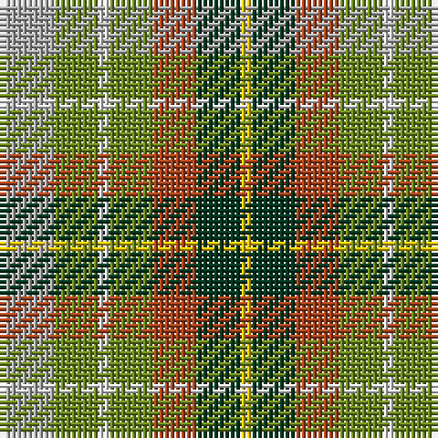

The parent of this is [Devon Original District Tartan Tartan Number: 1284. Earliest known date: 1984 The Devon Original and Devon Companion owe their origin to the success of the Cornish St Piran sett, which was woven by Coldharbour Mill in the early 1980's. The accreditation certificate was presented to the Mayor of Barnstaple in 1991. In a poem describing the tartan, Miss M. Miles says, "So, in the mind, Devon's beauty is retrieved By contemplating Devon's tartan's weave." See products available Copyright © Blair Urquhart, Comrie, 2015](/tartans/n/10/g8/ln2/g8/t8/dg8/y/2/)

This was sourced from house-of-tartan.  It is a [7 stripes tartan](/stripes/stripes7/).

Original link http://www.house-of-tartan.scotland.net/house/TartanViewjs.asp?colr=Def&tnam=1284

## Thread count
N/10 G8 LN2 G8 T8 DG8 Y/2

## Palette
Each colour and its ΔE from the base-6 reference it is a variant of.

| Colour | Shade | Base | ΔE (OKLab) |
|---|---|---|---|
| DG |  `#003820` | G  | 0.16 |
| DR |  `#480800` | B  | 0.23 |
| G |  `#6C8820` | G  | 0.16 |
| LN |  `#E0E0E0` | W  | 0.06 |
| N |  `#A8A8A8` | Y  | 0.19 |
| T |  `#A8441C` | R  | 0.08 |
| Y |  `#E8C000` | Y  | 0.00 |

# Sample pattern

ID: /variants/n/10/g8/ln2/g8/t8/dg8/y/2-dg003820-dr480800-g6c8820-lne0e0e0-na8a8a8-ta8441c-ye8c000/
