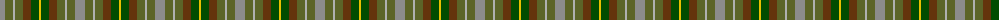

The parent of this is [Devon](/tartans/n/10/ga8/na2/ga8/t8/g8/y/2/)

This was sourced from register-of-tartans.  It is a [7 stripes tartan](/stripes/stripes7/).

Original link https://www.tartanregister.gov.uk/tartanDetails.aspx?ref=920

## Thread count
N/10 Ga8 Na2 Ga8 T8 G8 Y/2

## Palette
Each colour and its ΔE from the base-6 reference it is a variant of.

| Colour | Shade | Base | ΔE (OKLab) |
|---|---|---|---|
| G |  `#004C00` | G  | 0.08 |
| Ga |  `#5C6428` | G  | 0.09 |
| N |  `#8C8C8C` | R  | 0.24 |
| Na |  `#B0B0B0` | Y  | 0.18 |
| T |  `#64340C` | G  | 0.18 |
| Y |  `#E8C000` | Y  | 0.00 |

# Sample pattern

ID: /variants/n/10/ga8/na2/ga8/t8/g8/y/2-g004c00-ga5c6428-n8c8c8c-nab0b0b0-t64340c-ye8c000/
