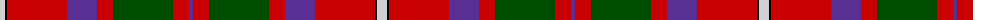
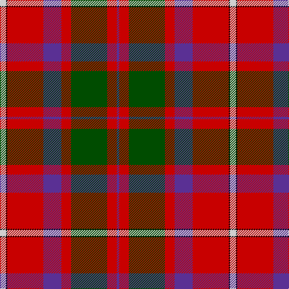

The parent of this is [Shaw](/tartans/n/10/k2/r60/p30/r16/g60/r16/p/4/)

This was sourced from weddslist.  It is a [8 stripes tartan](/stripes/stripes8/).

Original link http://www.weddslist.com/cgi-bin/tartans/pg.pl?source=rb

## Thread count
N/10 K2 R60 P30 R16 G60 R16 P/4

## Palette
Each colour and its ΔE from the base-6 reference it is a variant of.

| Colour | Shade | Base | ΔE (OKLab) |
|---|---|---|---|
| G |  `#004C00` | G  | 0.08 |
| K |  `#000000` | K  | 0.00 |
| N |  `#D0D0D0` | W  | 0.11 |
| P |  `#5A3094` | B  | 0.08 |
| R |  `#C80000` | R  | 0.00 |

# Sample pattern

ID: /variants/n/10/k2/r60/p30/r16/g60/r16/p/4-g004c00-k000000-nd0d0d0-p5a3094-rc80000/
