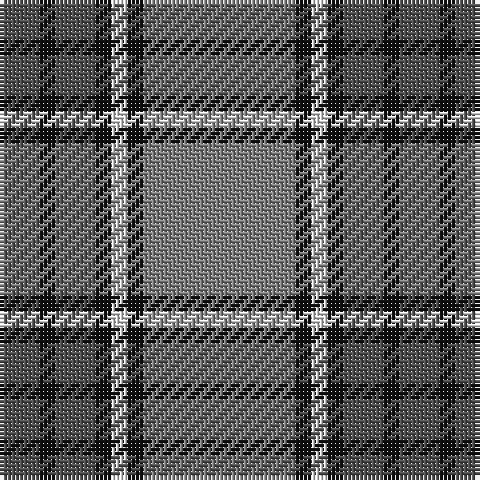

The parent of this is [Kyle](/tartans/n/10/k4/n10/k4/ln4/k4/na/38/)

This was sourced from register-of-tartans.  It is a [7 stripes tartan](/stripes/stripes7/).

Original link https://www.tartanregister.gov.uk/tartanDetails.aspx?ref=2018

## Thread count
N/10 K4 N10 K4 LN4 K4 Na/38

## Palette
Each colour and its ΔE from the base-6 reference it is a variant of.

| Colour | Shade | Base | ΔE (OKLab) |
|---|---|---|---|
| K |  `#101010` | K  | 0.17 |
| LN |  `#E0E0E0` | W  | 0.06 |
| N |  `#505050` | B  | 0.12 |
| Na |  `#808080` | G  | 0.22 |

# Sample pattern

ID: /variants/n/10/k4/n10/k4/ln4/k4/na/38-k101010-lne0e0e0-n505050-na808080/
