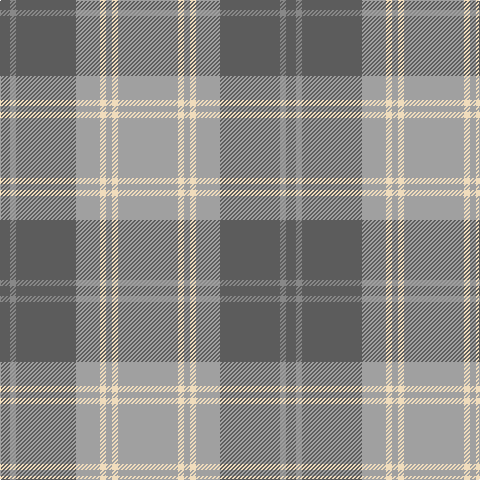

The parent of this is [Dama Classic (Fashion)](/tartans/n/10/nb6/n60/na24/w6/na6/w6/na/60/)

This was sourced from tartans-authority.  It is a [8 stripes tartan](/stripes/stripes8/).

Original link http://www.tartansauthority.com/tartan-ferret/display/10208/

## Thread count
N/10 Nb6 N60 Na24 W6 Na6 W6 Na/60

## Palette
Each colour and its ΔE from the base-6 reference it is a variant of.

| Colour | Shade | Base | ΔE (OKLab) |
|---|---|---|---|
| N |  `#5C5C5C` | B  | 0.14 |
| Na |  `#A0A0A0` | Y  | 0.20 |
| Nb |  `#888888` | R  | 0.24 |
| W |  `#F0DCBC` | W  | 0.08 |

# Sample pattern

ID: /variants/n/10/nb6/n60/na24/w6/na6/w6/na/60-n5c5c5c-naa0a0a0-nb888888-wf0dcbc/
