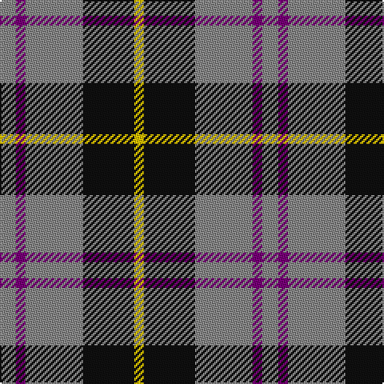

The parent of this is [New York State Police (Corporate)](/tartans/n/10/p6/n36/k32/y/6/)

This was sourced from tartans-authority.  It is a [5 stripes tartan](/stripes/stripes5/).

Original link http://www.tartansauthority.com/tartan-ferret/display/5619/

## Thread count
N/10 P6 N36 K32 Y/6

## Palette
Each colour and its ΔE from the base-6 reference it is a variant of.

| Colour | Shade | Base | ΔE (OKLab) |
|---|---|---|---|
| K |  `#101010` | K  | 0.17 |
| N |  `#888888` | R  | 0.24 |
| P |  `#780078` | B  | 0.16 |
| Y |  `#E8C000` | Y  | 0.00 |

# Sample pattern

ID: /variants/n/10/p6/n36/k32/y/6-k101010-n888888-p780078-ye8c000/
