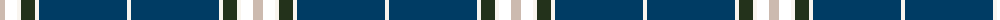

The parent of this is [Leblant-Macqueron (Personal)](/tartans/n/10/t12/w4/k14/w4/db88/w/4/)

This was sourced from register-of-tartans.  It is a [7 stripes tartan](/stripes/stripes7/).

Original link https://www.tartanregister.gov.uk/tartanDetails.aspx?ref=10609

## Thread count
N/10 T12 W4 K14 W4 DB88 W/4

## Palette
Each colour and its ΔE from the base-6 reference it is a variant of.

| Colour | Shade | Base | ΔE (OKLab) |
|---|---|---|---|
| DB |  `#003C64` | B  | 0.07 |
| K |  `#23321B` | G  | 0.17 |
| N |  `#CCBAAF` | Y  | 0.15 |
| W |  `#F9F5EF` | W  | 0.01 |

# Sample pattern

ID: /variants/n/10/t12/w4/k14/w4/db88/w/4-db003c64-k23321b-nccbaaf-wf9f5ef/
