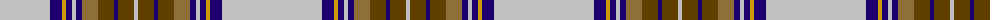

The parent of this is [Renfrew #2](/tartans/n/100/db12/dy4/db6/n4/db6/lt16/t16/db4/t16/n/4/)

This was sourced from register-of-tartans.  It is a [11 stripes tartan](/stripes/stripes11/).

Original link https://www.tartanregister.gov.uk/tartanDetails.aspx?ref=3499

## Thread count
N/100 DB12 DY4 DB6 N4 DB6 LT16 T16 DB4 T16 N/4

## Palette
Each colour and its ΔE from the base-6 reference it is a variant of.

| Colour | Shade | Base | ΔE (OKLab) |
|---|---|---|---|
| DB |  `#1C0070` | B  | 0.14 |
| DY |  `#D09800` | Y  | 0.11 |
| LT |  `#8C7038` | G  | 0.18 |
| N |  `#C0C0C0` | W  | 0.16 |
| T |  `#604000` | G  | 0.14 |

ID: /variants/n/100/db12/dy4/db6/n4/db6/lt16/t16/db4/t16/n/4-db1c0070-dyd09800-lt8c7038-nc0c0c0-t604000/
