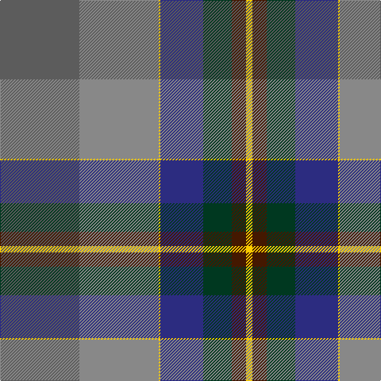

The parent of this is [Lachance (Commemorative)](/tartans/n/100/na100/y2/db54/dg36/dr18/y/8/)

This was sourced from tartans-authority.  It is a [7 stripes tartan](/stripes/stripes7/).

Original link http://www.tartansauthority.com/tartan-ferret/display/10645/

## Thread count
N/100 Na100 Y2 DB54 DG36 DR18 Y/8

## Palette
Each colour and its ΔE from the base-6 reference it is a variant of.

| Colour | Shade | Base | ΔE (OKLab) |
|---|---|---|---|
| DB |  `#2C2C80` | B  | 0.05 |
| DG |  `#003820` | G  | 0.16 |
| DR |  `#441800` | B  | 0.22 |
| N |  `#5C5C5C` | B  | 0.14 |
| Na |  `#888888` | R  | 0.24 |
| Y |  `#FCCC00` | Y  | 0.04 |

# Sample pattern

ID: /variants/n/100/na100/y2/db54/dg36/dr18/y/8-db2c2c80-dg003820-dr441800-n5c5c5c-na888888-yfccc00/
