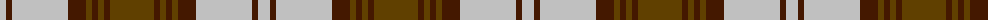

The parent of this is [Kildonan Brown (Fashion)](/tartans/n/12/dr6/n56/dr18/t6/dr6/t6/dr6/t/44/)

This was sourced from tartans-authority.  It is a [9 stripes tartan](/stripes/stripes9/).

Original link http://www.tartansauthority.com/tartan-ferret/display/8824/

## Thread count
N/12 DR6 N56 DR18 T6 DR6 T6 DR6 T/44

## Palette
Each colour and its ΔE from the base-6 reference it is a variant of.

| Colour | Shade | Base | ΔE (OKLab) |
|---|---|---|---|
| DR |  `#441800` | B  | 0.22 |
| N |  `#C0C0C0` | W  | 0.16 |
| T |  `#604000` | G  | 0.14 |

ID: /variants/n/12/dr6/n56/dr18/t6/dr6/t6/dr6/t/44-dr441800-nc0c0c0-t604000/
