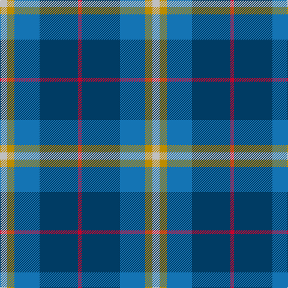

The parent of this is [Jamieson, Robert (Personal)](/tartans/n/12/dy12/b42/db64/r/6/)

This was sourced from tartans-authority.  It is a [5 stripes tartan](/stripes/stripes5/).

Original link http://www.tartansauthority.com/tartan-ferret/display/8549/

## Thread count
N/12 DY12 B42 DB64 R/6

## Palette
Each colour and its ΔE from the base-6 reference it is a variant of.

| Colour | Shade | Base | ΔE (OKLab) |
|---|---|---|---|
| B |  `#1474B4` | B  | 0.15 |
| DB |  `#003C64` | B  | 0.07 |
| DY |  `#BC8C00` | Y  | 0.16 |
| N |  `#C0C0C0` | W  | 0.16 |
| R |  `#C8002C` | R  | 0.03 |

# Sample pattern

ID: /variants/n/12/dy12/b42/db64/r/6-b1474b4-db003c64-dybc8c00-nc0c0c0-rc8002c/
