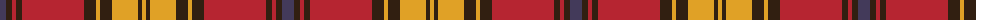

The parent of this is [Rourke-Frew (Ontario)](/tartans/n/12/k6/r4/k6/r62/k12/y4/k12/y26/k4/y/4/)

This was sourced from register-of-tartans.  It is a [11 stripes tartan](/stripes/stripes11/).

Original link https://www.tartanregister.gov.uk/tartanDetails.aspx?ref=10819

## Thread count
N/12 K6 R4 K6 R62 K12 Y4 K12 Y26 K4 Y/4

## Palette
Each colour and its ΔE from the base-6 reference it is a variant of.

| Colour | Shade | Base | ΔE (OKLab) |
|---|---|---|---|
| K |  `#311F11` | B  | 0.20 |
| N |  `#433A5A` | B  | 0.08 |
| R |  `#B62531` | R  | 0.04 |
| Y |  `#E0A126` | Y  | 0.08 |

ID: /variants/n/12/k6/r4/k6/r62/k12/y4/k12/y26/k4/y/4-k311f11-n433a5a-rb62531-ye0a126/
