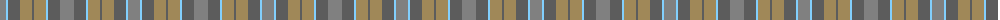

The parent of this is [Outlander #2](/tartans/n/12/lb2/na12/lt12/na2/lt12/lb2/na12/n/14/)

This was sourced from register-of-tartans.  It is a [9 stripes tartan](/stripes/stripes9/).

Original link https://www.tartanregister.gov.uk/tartanDetails.aspx?ref=11114

## Thread count
N/12 LB2 Na12 LT12 Na2 LT12 LB2 Na12 N/14

## Palette
Each colour and its ΔE from the base-6 reference it is a variant of.

| Colour | Shade | Base | ΔE (OKLab) |
|---|---|---|---|
| LB |  `#82CFFD` | W  | 0.18 |
| LT |  `#A08858` | Y  | 0.21 |
| N |  `#808080` | G  | 0.22 |
| Na |  `#5C5C5C` | B  | 0.14 |

ID: /variants/n/12/lb2/na12/lt12/na2/lt12/lb2/na12/n/14-lb82cffd-lta08858-n808080-na5c5c5c/
