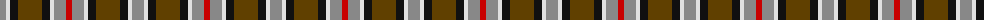

The parent of this is [Strathblane](/tartans/n/12/ln4/k8/t24/k8/ln4/n12/r/6/)

This was sourced from register-of-tartans.  It is a [8 stripes tartan](/stripes/stripes8/).

Original link https://www.tartanregister.gov.uk/tartanDetails.aspx?ref=3978

## Thread count
N/12 LN4 K8 T24 K8 LN4 N12 R/6

## Palette
Each colour and its ΔE from the base-6 reference it is a variant of.

| Colour | Shade | Base | ΔE (OKLab) |
|---|---|---|---|
| K |  `#101010` | K  | 0.17 |
| LN |  `#E0E0E0` | W  | 0.06 |
| N |  `#888888` | R  | 0.24 |
| R |  `#C80000` | R  | 0.00 |
| T |  `#604000` | G  | 0.14 |

# Sample pattern

ID: /variants/n/12/ln4/k8/t24/k8/ln4/n12/r/6-k101010-lne0e0e0-n888888-rc80000-t604000/
