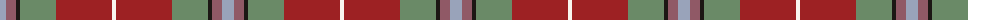

The parent of this is [Dundhuin](/tartans/n/12/lt10/k4/g36/dr56/w/4/)

This was sourced from register-of-tartans.  It is a [6 stripes tartan](/stripes/stripes6/).

Original link https://www.tartanregister.gov.uk/tartanDetails.aspx?ref=10243

## Thread count
N/12 LT10 K4 G36 DR56 W/4

## Palette
Each colour and its ΔE from the base-6 reference it is a variant of.

| Colour | Shade | Base | ΔE (OKLab) |
|---|---|---|---|
| DR |  `#9D2123` | R  | 0.09 |
| G |  `#6A8A67` | G  | 0.18 |
| K |  `#1C1714` | K  | 0.21 |
| LT |  `#905966` | R  | 0.15 |
| N |  `#99A3BA` | Y  | 0.23 |
| W |  `#F9F5EF` | W  | 0.01 |

# Sample pattern

ID: /variants/n/12/lt10/k4/g36/dr56/w/4-dr9d2123-g6a8a67-k1c1714-lt905966-n99a3ba-wf9f5ef/
