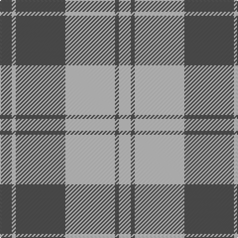

The parent of this is [Erskine, Grey](/tartans/n/12/na4/n50/na50/n4/na/12/)

This was sourced from register-of-tartans.  It is a [6 stripes tartan](/stripes/stripes6/).

Original link https://www.tartanregister.gov.uk/tartanDetails.aspx?ref=1129

## Thread count
N/12 Na4 N50 Na50 N4 Na/12

## Palette
Each colour and its ΔE from the base-6 reference it is a variant of.

| Colour | Shade | Base | ΔE (OKLab) |
|---|---|---|---|
| N |  `#505050` | B  | 0.12 |
| Na |  `#C0C0C0` | W  | 0.16 |

# Sample pattern

ID: /variants/n/12/na4/n50/na50/n4/na/12-n505050-nac0c0c0/
