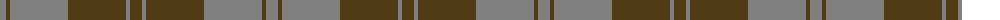

The parent of this is [Harmony 12 #2](/tartans/n/12/t4/n58/t58/n4/t/12/)

This was sourced from register-of-tartans.  It is a [6 stripes tartan](/stripes/stripes6/).

Original link https://www.tartanregister.gov.uk/tartanDetails.aspx?ref=1606

## Thread count
N/12 T4 N58 T58 N4 T/12

## Palette
Each colour and its ΔE from the base-6 reference it is a variant of.

| Colour | Shade | Base | ΔE (OKLab) |
|---|---|---|---|
| N |  `#808080` | G  | 0.22 |
| T |  `#503C14` | G  | 0.15 |

# Sample pattern

ID: /variants/n/12/t4/n58/t58/n4/t/12-n808080-t503c14/
