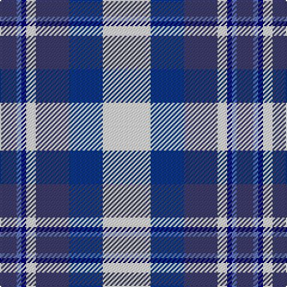

The parent of this is [Earl of St. Andrews Dress](/tartans/n/14/b4/dba4/w8/n28/db28/w/40/)

This was sourced from register-of-tartans.  It is a [7 stripes tartan](/stripes/stripes7/).

Original link https://www.tartanregister.gov.uk/tartanDetails.aspx?ref=1064

## Thread count
N/14 B4 DBa4 W8 N28 DB28 W/40

## Palette
Each colour and its ΔE from the base-6 reference it is a variant of.

| Colour | Shade | Base | ΔE (OKLab) |
|---|---|---|---|
| B |  `#6478B0` | B  | 0.19 |
| DB |  `#003478` | B  | 0.06 |
| DBa |  `#000064` | B  | 0.17 |
| N |  `#3C3C64` | B  | 0.06 |
| W |  `#F8F8F8` | W  | 0.01 |

# Sample pattern

ID: /variants/n/14/b4/dba4/w8/n28/db28/w/40-b6478b0-db003478-dba000064-n3c3c64-wf8f8f8/
