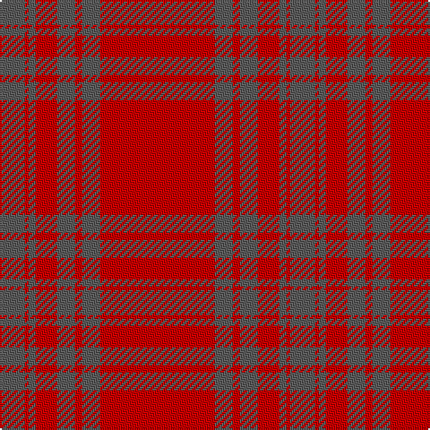

The parent of this is [Lomond](/tartans/n/14/r2/n4/r12/n10/r4/n10/r/64/)

This was sourced from register-of-tartans.  It is a [8 stripes tartan](/stripes/stripes8/).

Original link https://www.tartanregister.gov.uk/tartanDetails.aspx?ref=2191

## Thread count
N/14 R2 N4 R12 N10 R4 N10 R/64

## Palette
Each colour and its ΔE from the base-6 reference it is a variant of.

| Colour | Shade | Base | ΔE (OKLab) |
|---|---|---|---|
| N |  `#5C5C5C` | B  | 0.14 |
| R |  `#C80000` | R  | 0.00 |

# Sample pattern

ID: /variants/n/14/r2/n4/r12/n10/r4/n10/r/64-n5c5c5c-rc80000/
