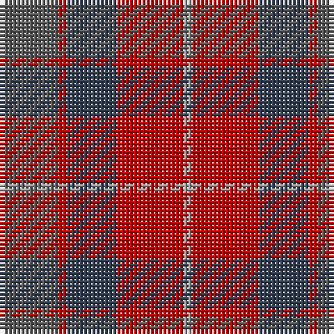

The parent of this is [Callum (Buchan) (Name)](/tartans/n/14/r2/nb12/r16/na/2/)

This was sourced from tartans-authority.  It is a [5 stripes tartan](/stripes/stripes5/).

Original link http://www.tartansauthority.com/tartan-ferret/display/10322/

## Thread count
N/14 R2 Nb12 R16 Na/2

## Palette
Each colour and its ΔE from the base-6 reference it is a variant of.

| Colour | Shade | Base | ΔE (OKLab) |
|---|---|---|---|
| N |  `#5C5C5C` | B  | 0.14 |
| Na |  `#A0A0A0` | Y  | 0.20 |
| Nb |  `#344054` | B  | 0.08 |
| R |  `#C80000` | R  | 0.00 |

# Sample pattern

ID: /variants/n/14/r2/nb12/r16/na/2-n5c5c5c-naa0a0a0-nb344054-rc80000/
