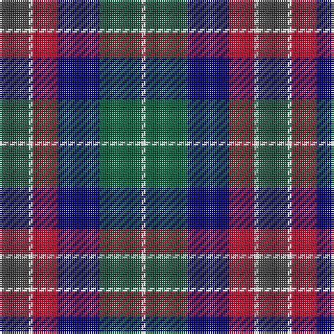

The parent of this is [McEachern, Andrew](/tartans/n/14/w2/r12/db20/g20/w/2/)

This was sourced from register-of-tartans.  It is a [6 stripes tartan](/stripes/stripes6/).

Original link https://www.tartanregister.gov.uk/tartanDetails.aspx?ref=10765

## Thread count
N/14 W2 R12 DB20 G20 W/2

## Palette
Each colour and its ΔE from the base-6 reference it is a variant of.

| Colour | Shade | Base | ΔE (OKLab) |
|---|---|---|---|
| DB |  `#000080` | B  | 0.14 |
| G |  `#00643C` | G  | 0.06 |
| N |  `#404040` | B  | 0.12 |
| R |  `#C8002C` | R  | 0.03 |
| W |  `#FFFFF0` | W  | 0.03 |

# Sample pattern

ID: /variants/n/14/w2/r12/db20/g20/w/2-db000080-g00643c-n404040-rc8002c-wfffff0/
