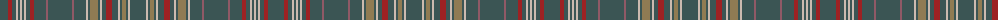

The parent of this is [Delmarva](/tartans/n/16/dr4/n4/na2/n2/na2/n2/na2/n4/dr4/n12/lt2/n24/lt2/n12/na2/n2/lta8/n2/na2/n4/dr6/n6/na2/n2/lta4/n2/na2/n/16/)

This was sourced from register-of-tartans.  It is a [29 stripes tartan](/stripes/stripes29/).

Original link https://www.tartanregister.gov.uk/tartanDetails.aspx?ref=10158

## Thread count
N/16 DR4 N4 Na2 N2 Na2 N2 Na2 N4 DR4 N12 LT2 N24 LT2 N12 Na2 N2 LTa8 N2 Na2 N4 DR6 N6 Na2 N2 LTa4 N2 Na2 N/16

## Palette
Each colour and its ΔE from the base-6 reference it is a variant of.

| Colour | Shade | Base | ΔE (OKLab) |
|---|---|---|---|
| DR |  `#9D2123` | R  | 0.09 |
| LT |  `#905966` | R  | 0.15 |
| LTa |  `#907B53` | R  | 0.20 |
| N |  `#3B5554` | B  | 0.12 |
| Na |  `#CCBAAF` | Y  | 0.15 |

ID: /variants/n/16/dr4/n4/na2/n2/na2/n2/na2/n4/dr4/n12/lt2/n24/lt2/n12/na2/n2/lta8/n2/na2/n4/dr6/n6/na2/n2/lta4/n2/na2/n/16-dr9d2123-lt905966-lta907b53-n3b5554-naccbaaf/
