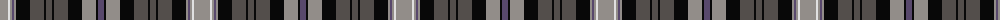

The parent of this is [Black Scottish National Tartan Tartan Number: 6622. Earliest known date: Marton Mills./Threadcount and colours aren't 100% original. Generated manually./ See products available Copyright © Blair Urquhart, Comrie, 2015](/tartans/n/16/ln2/n2/nb2/n2/k14/na14/k2/na6/k2/na14/k14/n14/k2/nb/6/)

This was sourced from house-of-tartan.  It is a [15 stripes tartan](/stripes/stripes15/).

Original link http://www.house-of-tartan.scotland.net/house/TartanViewjs.asp?colr=Def&tnam=6622

## Thread count
N/16 LN2 N2 Nb2 N2 K14 Na14 K2 Na6 K2 Na14 K14 N14 K2 Nb/6

## Palette
Each colour and its ΔE from the base-6 reference it is a variant of.

| Colour | Shade | Base | ΔE (OKLab) |
|---|---|---|---|
| K |  `#080808` | K  | 0.13 |
| LN |  `#E0E0E0` | W  | 0.06 |
| N |  `#928D89` | Y  | 0.24 |
| Na |  `#534E4B` | B  | 0.13 |
| Nb |  `#58486C` | B  | 0.09 |

ID: /variants/n/16/ln2/n2/nb2/n2/k14/na14/k2/na6/k2/na14/k14/n14/k2/nb/6-k080808-lne0e0e0-n928d89-na534e4b-nb58486c/
