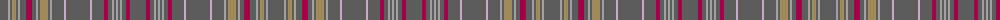

The parent of this is [Delmarva (District)](/tartans/n/16/na2/n2/lt4/n2/na2/n6/r6/n4/na2/n2/lt8/n2/na2/n12/nb2/n24/nb2/n12/r4/n4/na2/n2/na2/n2/na2/n4/r4/n/16/)

This was sourced from tartans-authority.  It is a [29 stripes tartan](/stripes/stripes29/).

Original link http://www.tartansauthority.com/tartan-ferret/display/10158/

## Thread count
N/16 Na2 N2 LT4 N2 Na2 N6 R6 N4 Na2 N2 LT8 N2 Na2 N12 Nb2 N24 Nb2 N12 R4 N4 Na2 N2 Na2 N2 Na2 N4 R4 N/16

## Palette
Each colour and its ΔE from the base-6 reference it is a variant of.

| Colour | Shade | Base | ΔE (OKLab) |
|---|---|---|---|
| LT |  `#A08858` | Y  | 0.21 |
| N |  `#5C5C5C` | B  | 0.14 |
| Na |  `#A0A0A0` | Y  | 0.20 |
| Nb |  `#C4ACC4` | W  | 0.20 |
| R |  `#A00048` | R  | 0.11 |

ID: /variants/n/16/na2/n2/lt4/n2/na2/n6/r6/n4/na2/n2/lt8/n2/na2/n12/nb2/n24/nb2/n12/r4/n4/na2/n2/na2/n2/na2/n4/r4/n/16-lta08858-n5c5c5c-naa0a0a0-nbc4acc4-ra00048/
