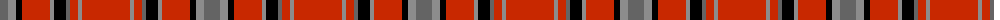

The parent of this is [Dobrain (Personal)](/tartans/n/16/na8/k6/r28/na4/k12/n4/r8/na4/r/48/)

This was sourced from register-of-tartans.  It is a [10 stripes tartan](/stripes/stripes10/).

Original link https://www.tartanregister.gov.uk/tartanDetails.aspx?ref=941

## Thread count
N/16 Na8 K6 R28 Na4 K12 N4 R8 Na4 R/48

## Palette
Each colour and its ΔE from the base-6 reference it is a variant of.

| Colour | Shade | Base | ΔE (OKLab) |
|---|---|---|---|
| K |  `#000000` | K  | 0.00 |
| N |  `#646464` | B  | 0.16 |
| Na |  `#8C8C8C` | R  | 0.24 |
| R |  `#C82800` | R  | 0.03 |

ID: /variants/n/16/na8/k6/r28/na4/k12/n4/r8/na4/r/48-k000000-n646464-na8c8c8c-rc82800/
