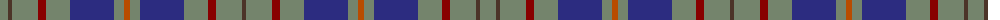

The parent of this is [Kildare, County](/tartans/n/16/t4/n26/dr8/n24/db44/n10/do6/n10/db44/n24/dr8/n26/t/4/)

This was sourced from register-of-tartans.  It is a [14 stripes tartan](/stripes/stripes14/).

Original link https://www.tartanregister.gov.uk/tartanDetails.aspx?ref=1965

## Thread count
N/16 T4 N26 DR8 N24 DB44 N10 DO6 N10 DB44 N24 DR8 N26 T/4

## Palette
Each colour and its ΔE from the base-6 reference it is a variant of.

| Colour | Shade | Base | ΔE (OKLab) |
|---|---|---|---|
| DB |  `#2C2C80` | B  | 0.05 |
| DO |  `#B84C00` | R  | 0.08 |
| DR |  `#880000` | R  | 0.14 |
| N |  `#74846C` | G  | 0.19 |
| T |  `#4C3428` | B  | 0.16 |

ID: /variants/n/16/t4/n26/dr8/n24/db44/n10/do6/n10/db44/n24/dr8/n26/t/4-db2c2c80-dob84c00-dr880000-n74846c-t4c3428/
