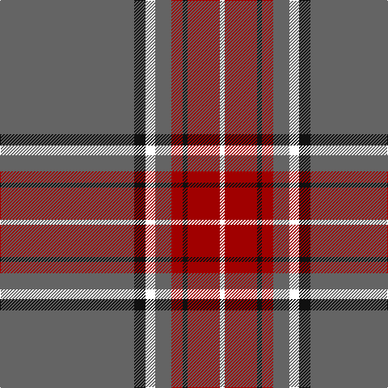

The parent of this is [President High School](/tartans/n/166/k14/w12/n20/dr14/k6/dr40/w/6/)

This was sourced from register-of-tartans.  It is a [8 stripes tartan](/stripes/stripes8/).

Original link https://www.tartanregister.gov.uk/tartanDetails.aspx?ref=11002

## Thread count
N/166 K14 W12 N20 DR14 K6 DR40 W/6

## Palette
Each colour and its ΔE from the base-6 reference it is a variant of.

| Colour | Shade | Base | ΔE (OKLab) |
|---|---|---|---|
| DR |  `#A00000` | R  | 0.09 |
| K |  `#101010` | K  | 0.17 |
| N |  `#646464` | B  | 0.16 |
| W |  `#FFFFFF` | W  | 0.03 |

# Sample pattern

ID: /variants/n/166/k14/w12/n20/dr14/k6/dr40/w/6-dra00000-k101010-n646464-wffffff/
