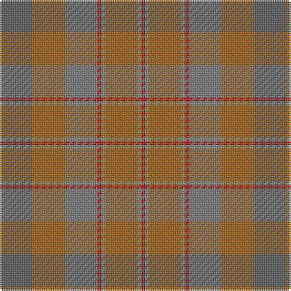

The parent of this is [Jardine (Clan)](/tartans/n/18/do18/na18/r2/lg2/do18/lg2/r/2/)

This was sourced from tartans-authority.  It is a [8 stripes tartan](/stripes/stripes8/).

Original link http://www.tartansauthority.com/tartan-ferret/display/1432/

## Thread count
N/18 DO18 Na18 R2 LG2 DO18 LG2 R/2

## Palette
Each colour and its ΔE from the base-6 reference it is a variant of.

| Colour | Shade | Base | ΔE (OKLab) |
|---|---|---|---|
| DO |  `#A46000` | R  | 0.14 |
| LG |  `#789484` | G  | 0.23 |
| N |  `#5C5C5C` | B  | 0.14 |
| Na |  `#787878` | G  | 0.20 |
| R |  `#C80000` | R  | 0.00 |

# Sample pattern

ID: /variants/n/18/do18/na18/r2/lg2/do18/lg2/r/2-doa46000-lg789484-n5c5c5c-na787878-rc80000/
