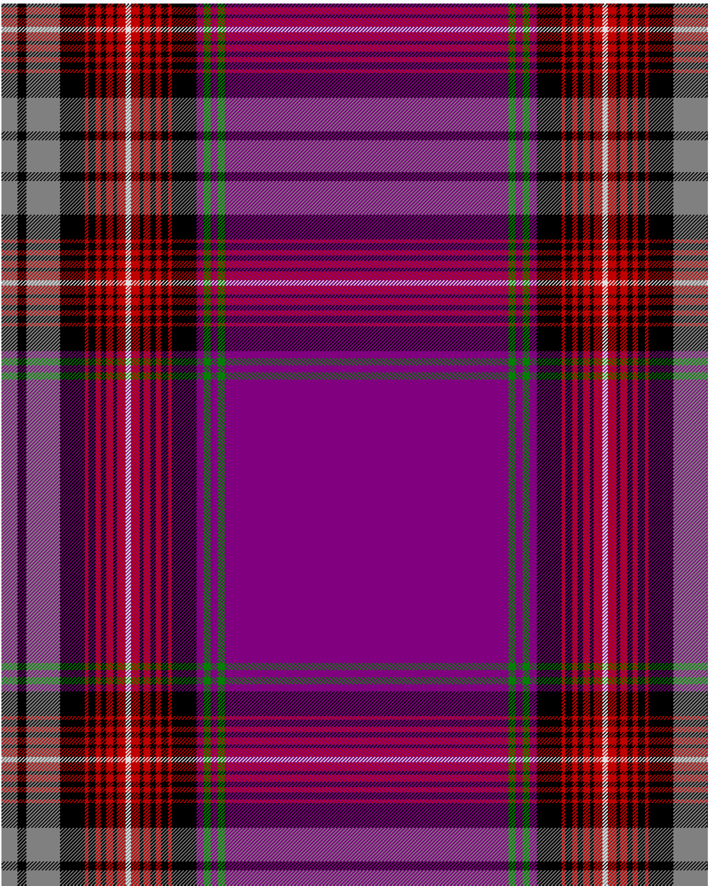

Arran

This was sourced from <no value>.  It is a 25 stripes tartan.

Original link http://www.weddslist.com/cgi-bin/tartans/pg.pl?source=sts

## Thread count
N/18 K10 N38 K28 R4 K8 R6 K6 R8 K4 R10 LN6 R10 K4 R8 K6 R6 K8 R4 K28 P8 G8 P8 G8 P/160

## Palette
G#008000 K#000000 LN#E0E0E0 N#808080 P#800080 R#C00000

# Sample pattern

ID: /variants/n/18/k10/n38/k28/r4/k8/r6/k6/r8/k4/r10/ln6/r10/k4/r8/k6/r6/k8/r4/k28/p8/g8/p8/g8/p/160-g008000-k000000-lne0e0e0-n808080-p800080-rc00000