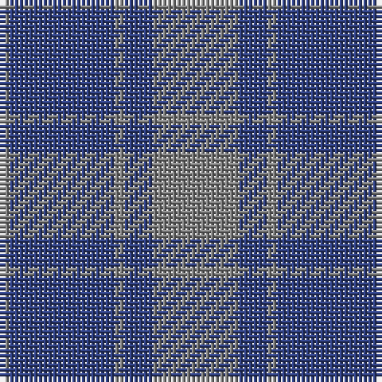

The parent of this is [MacCallum, High School](/tartans/n/2/b22/n2/b6/n/18/)

This was sourced from weddslist.  It is a [5 stripes tartan](/stripes/stripes5/).

Original link http://www.weddslist.com/cgi-bin/tartans/pg.pl?source=sts

## Thread count
N/2 B22 N2 B6 N/18

## Palette
Each colour and its ΔE from the base-6 reference it is a variant of.

| Colour | Shade | Base | ΔE (OKLab) |
|---|---|---|---|
| B |  `#304080` | B  | 0.01 |
| N |  `#808080` | G  | 0.22 |

# Sample pattern

ID: /variants/n/2/b22/n2/b6/n/18-b304080-n808080/
