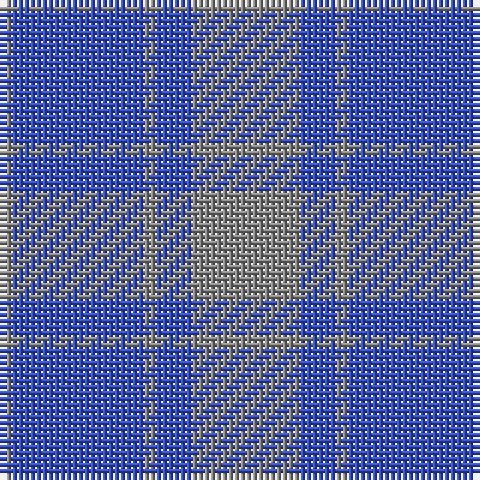

The parent of this is [MacCallum HS of Philadelphia (Corp)](/tartans/n/2/b22/n2/b6/n/18/)

This was sourced from tartans-authority.  It is a [5 stripes tartan](/stripes/stripes5/).

Original link http://www.tartansauthority.com/tartan-ferret/display/1279/

## Thread count
N/2 B22 N2 B6 N/18

## Palette
Each colour and its ΔE from the base-6 reference it is a variant of.

| Colour | Shade | Base | ΔE (OKLab) |
|---|---|---|---|
| B |  `#3850C8` | B  | 0.12 |
| N |  `#888888` | R  | 0.24 |

# Sample pattern

ID: /variants/n/2/b22/n2/b6/n/18-b3850c8-n888888/
