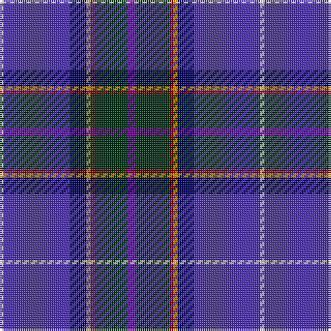

The parent of this is [Ellan Vannin (1958)](/tartans/n/2/b32/db8/dy2/dr2/dg16/p/4/)

This was sourced from register-of-tartans.  It is a [7 stripes tartan](/stripes/stripes7/).

Original link https://www.tartanregister.gov.uk/tartanDetails.aspx?ref=1100

## Thread count
N/2 B32 DB8 DY2 DR2 DG16 P/4

## Palette
Each colour and its ΔE from the base-6 reference it is a variant of.

| Colour | Shade | Base | ΔE (OKLab) |
|---|---|---|---|
| B |  `#4830A0` | B  | 0.07 |
| DB |  `#000050` | B  | 0.20 |
| DG |  `#003014` | G  | 0.18 |
| DR |  `#8C0000` | R  | 0.13 |
| DY |  `#C88C00` | Y  | 0.15 |
| N |  `#C8C8C8` | W  | 0.13 |
| P |  `#64008C` | B  | 0.13 |

# Sample pattern

ID: /variants/n/2/b32/db8/dy2/dr2/dg16/p/4-b4830a0-db000050-dg003014-dr8c0000-dyc88c00-nc8c8c8-p64008c/
