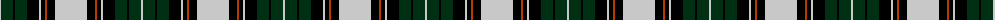

The parent of this is [Unidentified #49](/tartans/n/2/dg12/k2/dg12/k12/n2/k4/r2/k8/n/32/)

This was sourced from register-of-tartans.  It is a [10 stripes tartan](/stripes/stripes10/).

Original link https://www.tartanregister.gov.uk/tartanDetails.aspx?ref=4250

## Thread count
N/2 DG12 K2 DG12 K12 N2 K4 R2 K8 N/32

## Palette
Each colour and its ΔE from the base-6 reference it is a variant of.

| Colour | Shade | Base | ΔE (OKLab) |
|---|---|---|---|
| B |  `#788CB4` | B  | 0.25 |
| DB |  `#00008C` | B  | 0.13 |
| DG |  `#003014` | G  | 0.18 |
| DY |  `#C88C00` | Y  | 0.15 |
| K |  `#000000` | K  | 0.00 |
| N |  `#C8C8C8` | W  | 0.13 |
| P |  `#64008C` | B  | 0.13 |
| R |  `#B43C00` | R  | 0.06 |

ID: /variants/n/2/dg12/k2/dg12/k12/n2/k4/r2/k8/n/32-b788cb4-db00008c-dg003014-dyc88c00-k000000-nc8c8c8-p64008c-rb43c00/
