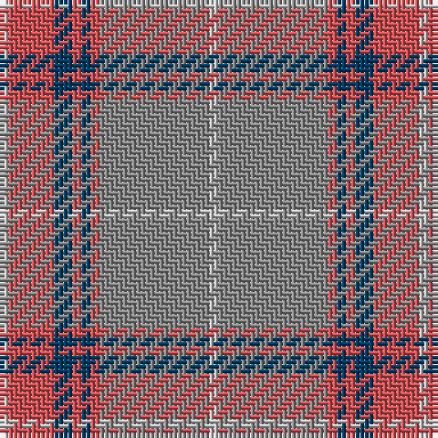

The parent of this is [Tenmaya Check (Corporate)](/tartans/n/2/do10/db4/do2/db2/do2/na24/n/2/)

This was sourced from tartans-authority.  It is a [8 stripes tartan](/stripes/stripes8/).

Original link http://www.tartansauthority.com/tartan-ferret/display/2346/

## Thread count
N/2 DO10 DB4 DO2 DB2 DO2 Na24 N/2

## Palette
Each colour and its ΔE from the base-6 reference it is a variant of.

| Colour | Shade | Base | ΔE (OKLab) |
|---|---|---|---|
| DB |  `#003C64` | B  | 0.07 |
| DO |  `#D05054` | R  | 0.10 |
| N |  `#C0C0C0` | W  | 0.16 |
| Na |  `#888888` | R  | 0.24 |

# Sample pattern

ID: /variants/n/2/do10/db4/do2/db2/do2/na24/n/2-db003c64-dod05054-nc0c0c0-na888888/
