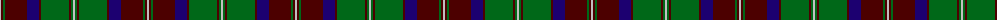

The parent of this is [Glen Tilt #1](/tartans/n/2/dr2/g2/dr22/db12/dr2/g28/dr2/g2/n/2/)

This was sourced from register-of-tartans.  It is a [10 stripes tartan](/stripes/stripes10/).

Original link https://www.tartanregister.gov.uk/tartanDetails.aspx?ref=1399

## Thread count
N/2 DR2 G2 DR22 DB12 DR2 G28 DR2 G2 N/2

## Palette
Each colour and its ΔE from the base-6 reference it is a variant of.

| Colour | Shade | Base | ΔE (OKLab) |
|---|---|---|---|
| DB |  `#1C0070` | B  | 0.14 |
| DR |  `#4C0000` | B  | 0.24 |
| G |  `#006818` | G  | 0.02 |
| N |  `#C0C0C0` | W  | 0.16 |

ID: /variants/n/2/dr2/g2/dr22/db12/dr2/g28/dr2/g2/n/2-db1c0070-dr4c0000-g006818-nc0c0c0/
