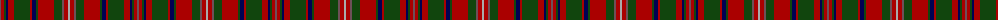

The parent of this is [MacKinnon](/tartans/n/2/dr3/dg2/db2/dr6/dg16/dr2/db4/dg2/dr16/dg8/n2/dr4/na/2/)

This was sourced from weddslist.  It is a [14 stripes tartan](/stripes/stripes14/).

Original link http://www.weddslist.com/cgi-bin/tartans/pg.pl?source=x

## Thread count
N/2 DR3 DG2 DB2 DR6 DG16 DR2 DB4 DG2 DR16 DG8 N2 DR4 Na/2

## Palette
Each colour and its ΔE from the base-6 reference it is a variant of.

| Colour | Shade | Base | ΔE (OKLab) |
|---|---|---|---|
| DB |  `#000052` | B  | 0.20 |
| DG |  `#11450D` | G  | 0.10 |
| DR |  `#AA0000` | R  | 0.06 |
| N |  `#6E5058` | B  | 0.14 |
| Na |  `#AAAAAA` | Y  | 0.19 |

ID: /variants/n/2/dr3/dg2/db2/dr6/dg16/dr2/db4/dg2/dr16/dg8/n2/dr4/na/2-db000052-dg11450d-draa0000-n6e5058-naaaaaaa/
