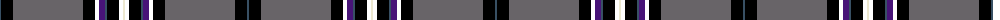

The parent of this is [Melrose Newbigging Grey](/tartans/n/2/k12/na70/k12/ab4/p6/n2/k12/ab4/w/2/)

This was sourced from register-of-tartans.  It is a [10 stripes tartan](/stripes/stripes10/).

Original link https://www.tartanregister.gov.uk/tartanDetails.aspx?ref=10500

## Thread count
N/2 K12 Na70 K12 AB4 P6 N2 K12 AB4 W/2

## Palette
Each colour and its ΔE from the base-6 reference it is a variant of.

| Colour | Shade | Base | ΔE (OKLab) |
|---|---|---|---|
| K |  `#000000` | K  | 0.00 |
| N |  `#385064` | B  | 0.08 |
| Na |  `#686468` | B  | 0.16 |
| P |  `#481478` | B  | 0.10 |
| W |  `#ECE8D0` | W  | 0.05 |

ID: /variants/n/2/k12/na70/k12/ab4/p6/n2/k12/ab4/w/2-k000000-n385064-na686468-p481478-wece8d0/
