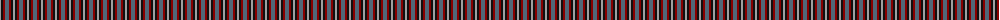
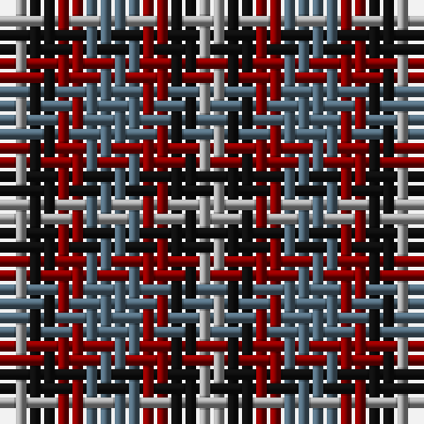

The parent of this is [Kucher, Gregory (Personal)](/tartans/n/2/k2/dr2/na/4/)

This was sourced from tartans-authority.  It is a [4 stripes tartan](/stripes/stripes4/).

Original link http://www.tartansauthority.com/tartan-ferret/display/10086/

## Thread count
N/2 K2 DR2 Na/4

## Palette
Each colour and its ΔE from the base-6 reference it is a variant of.

| Colour | Shade | Base | ΔE (OKLab) |
|---|---|---|---|
| DR |  `#880000` | R  | 0.14 |
| K |  `#101010` | K  | 0.17 |
| N |  `#A0A0A0` | Y  | 0.20 |
| Na |  `#506878` | B  | 0.14 |

# Sample pattern

ID: /variants/n/2/k2/dr2/na/4-dr880000-k101010-na0a0a0-na506878/
