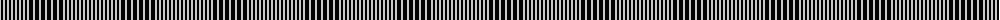

The parent of this is [Glenurquhart (Estate Check)](/tartans/n/2/k2/n2/k2/n2/k2/n2/k2/n2/k2/n2/k2/n2/k2/n2/k4/n2/k4/n2/k4/n/2/)

This was sourced from tartans-authority.  It is a [21 stripes tartan](/stripes/stripes21/).

Original link http://www.tartansauthority.com/tartan-ferret/display/5048/

## Thread count
N/2 K2 N2 K2 N2 K2 N2 K2 N2 K2 N2 K2 N2 K2 N2 K4 N2 K4 N2 K4 N/2

## Palette
Each colour and its ΔE from the base-6 reference it is a variant of.

| Colour | Shade | Base | ΔE (OKLab) |
|---|---|---|---|
| K |  `#000000` | K  | 0.00 |
| N |  `#C8C8C8` | W  | 0.13 |

ID: /variants/n/2/k2/n2/k2/n2/k2/n2/k2/n2/k2/n2/k2/n2/k2/n2/k4/n2/k4/n2/k4/n/2-k000000-nc8c8c8/
