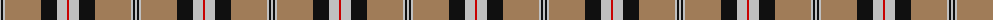
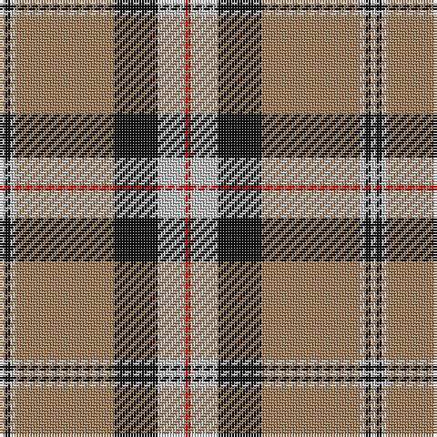

The parent of this is [Merrick, Camel (Fashion)](/tartans/n/2/k2/n2/lt36/k16/n10/r/2/)

This was sourced from tartans-authority.  It is a [7 stripes tartan](/stripes/stripes7/).

Original link http://www.tartansauthority.com/tartan-ferret/display/1688/

## Thread count
N/2 K2 N2 LT36 K16 N10 R/2

## Palette
Each colour and its ΔE from the base-6 reference it is a variant of.

| Colour | Shade | Base | ΔE (OKLab) |
|---|---|---|---|
| K |  `#101010` | K  | 0.17 |
| LT |  `#A07C58` | R  | 0.19 |
| N |  `#C0C0C0` | W  | 0.16 |
| R |  `#C80000` | R  | 0.00 |

# Sample pattern

ID: /variants/n/2/k2/n2/lt36/k16/n10/r/2-k101010-lta07c58-nc0c0c0-rc80000/
