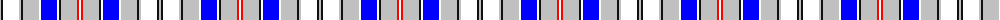

The parent of this is [Euphoria](/tartans/n/2/k2/w16/n2/k2/n16/w2/b16/w2/k2/n16/r2/w/2/)

This was sourced from register-of-tartans.  It is a [13 stripes tartan](/stripes/stripes13/).

Original link https://www.tartanregister.gov.uk/tartanDetails.aspx?ref=5860

## Thread count
N/2 K2 W16 N2 K2 N16 W2 B16 W2 K2 N16 R2 W/2

## Palette
Each colour and its ΔE from the base-6 reference it is a variant of.

| Colour | Shade | Base | ΔE (OKLab) |
|---|---|---|---|
| B |  `#0000FF` | B  | 0.21 |
| K |  `#101010` | K  | 0.17 |
| N |  `#C0C0C0` | W  | 0.16 |
| R |  `#FF0000` | R  | 0.11 |
| W |  `#FFFFFF` | W  | 0.03 |

ID: /variants/n/2/k2/w16/n2/k2/n16/w2/b16/w2/k2/n16/r2/w/2-b0000ff-k101010-nc0c0c0-rff0000-wffffff/
