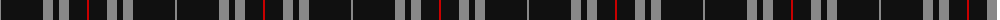
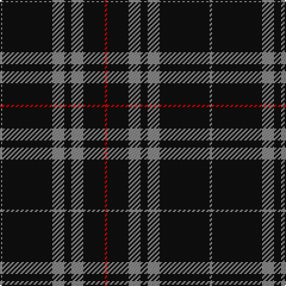

The parent of this is [Sunderland of Scotland Fashion Tartan Tartan Number: 7511. Earliest known date: July 2007 Woven by Lochcarron for Lyle & Scott of Hawick. Count & sample from Lochcarron. See products available Copyright © Blair Urquhart, Comrie, 2015](/tartans/n/2/k42/n10/k6/n10/k18/r/2/)

This was sourced from house-of-tartan.  It is a [7 stripes tartan](/stripes/stripes7/).

Original link http://www.house-of-tartan.scotland.net/house/TartanViewjs.asp?colr=Def&tnam=7511

## Thread count
N/2 K42 N10 K6 N10 K18 R/2

## Palette
Each colour and its ΔE from the base-6 reference it is a variant of.

| Colour | Shade | Base | ΔE (OKLab) |
|---|---|---|---|
| K |  `#101010` | K  | 0.17 |
| N |  `#888888` | R  | 0.24 |
| O |  `#EC8048` | Y  | 0.17 |
| Oa |  `#DC943C` | Y  | 0.12 |
| R |  `#C80000` | R  | 0.00 |

# Sample pattern

ID: /variants/n/2/k42/n10/k6/n10/k18/r/2-k101010-n888888-oec8048-oadc943c-rc80000/
