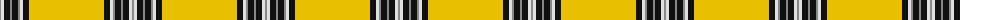

The parent of this is [Norton (Corporate)](/tartans/n/2/ln3/k6/n2/k6/n2/ln3/k6/y/75/)

This was sourced from tartans-authority.  It is a [9 stripes tartan](/stripes/stripes9/).

Original link http://www.tartansauthority.com/tartan-ferret/display/7834/

## Thread count
N/2 LN3 K6 N2 K6 N2 LN3 K6 Y/75

## Palette
Each colour and its ΔE from the base-6 reference it is a variant of.

| Colour | Shade | Base | ΔE (OKLab) |
|---|---|---|---|
| K |  `#101010` | K  | 0.17 |
| LN |  `#E0E0E0` | W  | 0.06 |
| N |  `#888888` | R  | 0.24 |
| Y |  `#E8C000` | Y  | 0.00 |

ID: /variants/n/2/ln3/k6/n2/k6/n2/ln3/k6/y/75-k101010-lne0e0e0-n888888-ye8c000/
