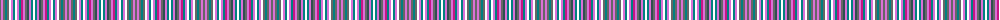

The parent of this is [Welly (Personal)](/tartans/n/2/lp2/n2/b2/n2/w2/lp2/b2/w2/lp2/b2/r2/lp2/n2/na2/lp2/b2/w/2/)

This was sourced from register-of-tartans.  It is a [18 stripes tartan](/stripes/stripes18/).

Original link https://www.tartanregister.gov.uk/tartanDetails.aspx?ref=10413

## Thread count
N/2 LP2 N2 B2 N2 W2 LP2 B2 W2 LP2 B2 R2 LP2 N2 Na2 LP2 B2 W/2

## Palette
Each colour and its ΔE from the base-6 reference it is a variant of.

| Colour | Shade | Base | ΔE (OKLab) |
|---|---|---|---|
| B |  `#008080` | G  | 0.16 |
| LP |  `#DA70D6` | R  | 0.27 |
| N |  `#666666` | B  | 0.16 |
| Na |  `#2F4F4F` | B  | 0.11 |
| R |  `#C71585` | R  | 0.15 |
| W |  `#FFFFFF` | W  | 0.03 |

ID: /variants/n/2/lp2/n2/b2/n2/w2/lp2/b2/w2/lp2/b2/r2/lp2/n2/na2/lp2/b2/w/2-b008080-lpda70d6-n666666-na2f4f4f-rc71585-wffffff/
