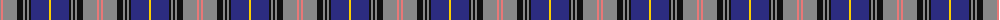

The parent of this is [Brady 60th (Personal)](/tartans/n/2/lr2/n14/k6/n2/k2/n2/k2/db18/y/2/)

This was sourced from tartans-authority.  It is a [10 stripes tartan](/stripes/stripes10/).

Original link http://www.tartansauthority.com/tartan-ferret/display/10404/

## Thread count
N/2 LR2 N14 K6 N2 K2 N2 K2 DB18 Y/2

## Palette
Each colour and its ΔE from the base-6 reference it is a variant of.

| Colour | Shade | Base | ΔE (OKLab) |
|---|---|---|---|
| DB |  `#2C2C80` | B  | 0.05 |
| K |  `#101010` | K  | 0.17 |
| LR |  `#E87878` | R  | 0.19 |
| N |  `#888888` | R  | 0.24 |
| Y |  `#FCCC00` | Y  | 0.04 |

ID: /variants/n/2/lr2/n14/k6/n2/k2/n2/k2/db18/y/2-db2c2c80-k101010-lre87878-n888888-yfccc00/
