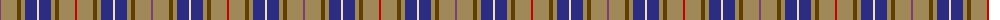

The parent of this is [MacKessog (Commemorative)](/tartans/n/2/lt16/t4/lt4/db12/w2/db12/lt4/t4/lt16/r/2/)

This was sourced from tartans-authority.  It is a [11 stripes tartan](/stripes/stripes11/).

Original link http://www.tartansauthority.com/tartan-ferret/display/6928/

## Thread count
N/2 LT16 T4 LT4 DB12 W2 DB12 LT4 T4 LT16 R/2

## Palette
Each colour and its ΔE from the base-6 reference it is a variant of.

| Colour | Shade | Base | ΔE (OKLab) |
|---|---|---|---|
| DB |  `#2C2C80` | B  | 0.05 |
| LT |  `#A08858` | Y  | 0.21 |
| N |  `#7C3C74` | B  | 0.14 |
| R |  `#C80000` | R  | 0.00 |
| T |  `#604000` | G  | 0.14 |
| W |  `#F0DCC0` | W  | 0.07 |

ID: /variants/n/2/lt16/t4/lt4/db12/w2/db12/lt4/t4/lt16/r/2-db2c2c80-lta08858-n7c3c74-rc80000-t604000-wf0dcc0/
