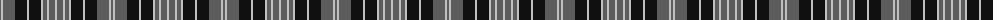

The parent of this is [Clergy, Grey (Corporate)](/tartans/n/2/na2/n12/k12/na2/k12/na2/n4/na2/n6/na/2/)

This was sourced from tartans-authority.  It is a [11 stripes tartan](/stripes/stripes11/).

Original link http://www.tartansauthority.com/tartan-ferret/display/1312/

## Thread count
N/2 Na2 N12 K12 Na2 K12 Na2 N4 Na2 N6 Na/2

## Palette
Each colour and its ΔE from the base-6 reference it is a variant of.

| Colour | Shade | Base | ΔE (OKLab) |
|---|---|---|---|
| K |  `#101010` | K  | 0.17 |
| N |  `#5C5C5C` | B  | 0.14 |
| Na |  `#C0C0C0` | W  | 0.16 |

ID: /variants/n/2/na2/n12/k12/na2/k12/na2/n4/na2/n6/na/2-k101010-n5c5c5c-nac0c0c0/
