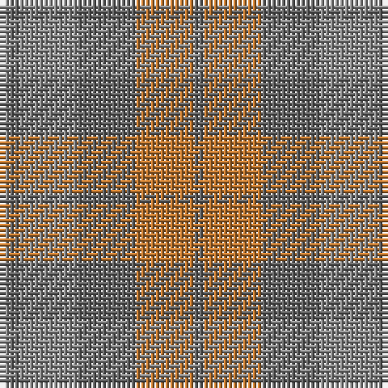

The parent of this is [Glen Burns (WCWM-2)](/tartans/n/2/na2/n12/na12/do12/na/2/)

This was sourced from register-of-tartans.  It is a [6 stripes tartan](/stripes/stripes6/).

Original link https://www.tartanregister.gov.uk/tartanDetails.aspx?ref=1368

## Thread count
N/2 Na2 N12 Na12 DO12 Na/2

## Palette
Each colour and its ΔE from the base-6 reference it is a variant of.

| Colour | Shade | Base | ΔE (OKLab) |
|---|---|---|---|
| DO |  `#BE7832` | R  | 0.17 |
| N |  `#8C8C8C` | R  | 0.24 |
| Na |  `#646464` | B  | 0.16 |

# Sample pattern

ID: /variants/n/2/na2/n12/na12/do12/na/2-dobe7832-n8c8c8c-na646464/
