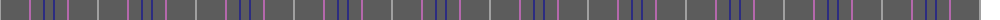
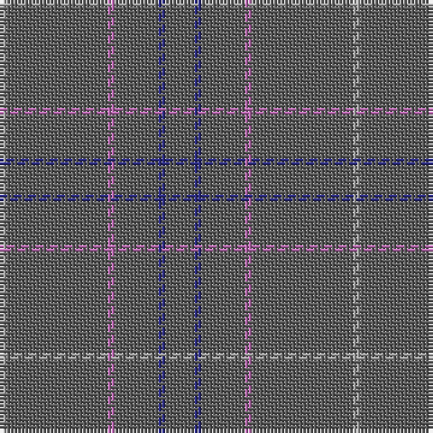

The parent of this is [Torridon Tweed](/tartans/n/2/na28/p2/na12/db2/na/8/)

This was sourced from register-of-tartans.  It is a [6 stripes tartan](/stripes/stripes6/).

Original link https://www.tartanregister.gov.uk/tartanDetails.aspx?ref=5543

## Thread count
N/2 Na28 P2 Na12 DB2 Na/8

## Palette
Each colour and its ΔE from the base-6 reference it is a variant of.

| Colour | Shade | Base | ΔE (OKLab) |
|---|---|---|---|
| DB |  `#2C2C80` | B  | 0.05 |
| N |  `#A0A0A0` | Y  | 0.20 |
| Na |  `#5C5C5C` | B  | 0.14 |
| P |  `#B468AC` | R  | 0.21 |

# Sample pattern

ID: /variants/n/2/na28/p2/na12/db2/na/8-db2c2c80-na0a0a0-na5c5c5c-pb468ac/
